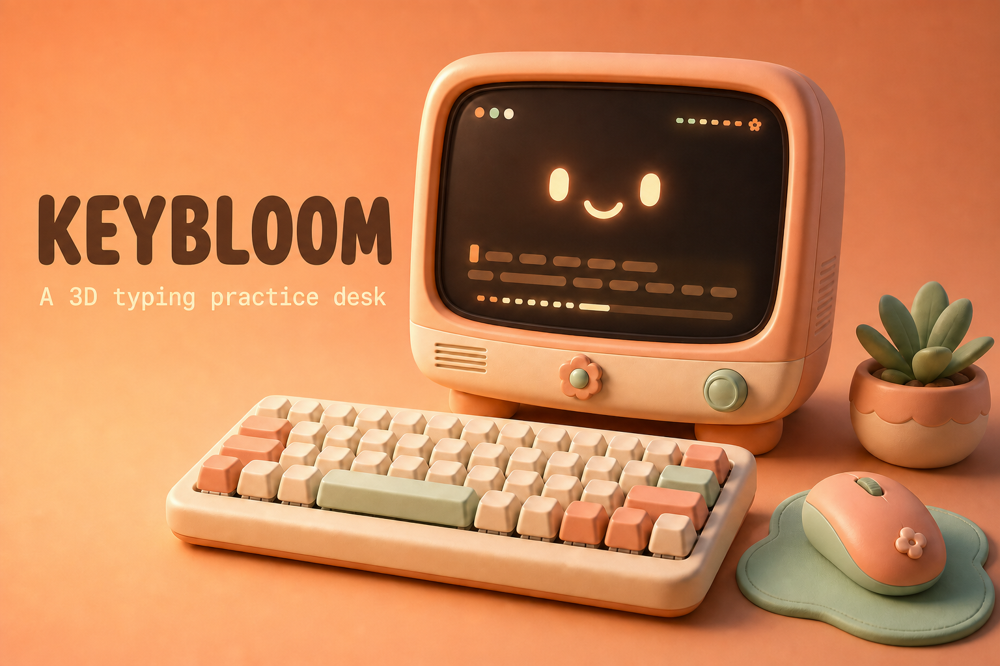

# Keybloom



**Keybloom** is a small 3D typing-practice website built around one idea: typing practice should feel a little more fun than staring at a plain textbox.

You sit down at a warm retro desk, pick a level and a timer on the monitor, then type. The keyboard reacts to your real keypresses, the monitor keeps up with your progress, and the whole thing is meant to feel like a tiny interactive desk setup rather than a normal typing test.

## What you can do

- Pick easy, medium, or hard passages
- Choose a practice time from one to five minutes
- See your WPM, accuracy, streak, and progress while you type
- Press real keys and watch their matching 3D keycaps move
- Switch between a calm day scene and a darker mechanical-keyboard mode
- Play or pause the desk music and use the retro monitor controls
- Click the mouse for a small physical click animation and sound

## Why I made it

Typing sites are useful, but they can feel a bit like homework. I wanted to make one that feels more like hanging out at a desk you actually want to use: warm colors, chunky keys, a friendly little monitor, and satisfying click-clack feedback.

The project is also my way of learning how much personality a website can have when the interface is part of a 3D scene instead of sitting on top of one.

## Built with

- [Next.js](https://nextjs.org/)
- [React](https://react.dev/)
- TypeScript
- [Three.js](https://threejs.org/)
- [React Three Fiber](https://docs.pmnd.rs/react-three-fiber)
- [React Three Drei](https://github.com/pmndrs/drei)
- WebGL, CSS, and the Web Audio API

The monitor, keyboard case, keycaps, mouse, lights, and desk are made from code. I did not use a downloaded 3D desk model; the fun part was building the little pieces myself from simple shapes.

## Running it locally

You will need Node.js 22.13 or newer.

```bash
npm install
npm run dev
```

Then open the local address shown in the terminal. For a production build, run:

```bash
npm run build
```

## A few tricky parts

The hardest part was making the desk look like one scene instead of a collection of floating objects. Camera angle, shadows, keyboard spacing, monitor height, and lighting all had to work together.

Keeping the typing game and the 3D keyboard in sync was another challenge. One keypress needs to update the passage, timer, accuracy, WPM, screen, and physical key animation at the same time. It took a lot of small adjustments, but that is what makes the keyboard feel alive.

## What's next

I would like to add saved personal bests, more passage themes, custom desk skins, and a few different typing modes. A friendly multiplayer race mode would be fun too.

---

Built for the 3D Websites Hackathon.
